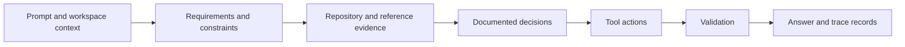

# Research: A Toy View of How the Request Is Handled

## Epistemic Boundary

This document is an educational model, not a dump of this agent's runtime. The actual tokenizer, model architecture, system context, parameters, attention values, hidden activations, logits, sampling settings, and private reasoning are not exposed by the available tools.

The factual, observable parts of this interaction are the supplied prompt, files read, commands run, files changed, diagnostics, and final answer. Everything below labeled "toy" is a small analogy for learning.

## Observable Agent Pipeline

At the product level, the interaction can be described without claiming hidden reasoning:



For this request, the observable transformation produced four work groups:

1. IDE product and architecture.
2. Extension contracts and process isolation.
3. Public interaction traceability.
4. Agent-agnostic collaboration rules.

This grouping is a useful output description. It is not a transcript of internal chain-of-thought.

## Transformer Concepts

A transformer commonly maps token IDs to vectors, adds position information, repeatedly mixes information through attention and feed-forward layers, and predicts a distribution for the next token.

For one attention head, learned projection matrices create query, key, and value vectors:

```text
Q = X Wq
K = X Wk
V = X Wv
scores = Q K^T / sqrt(dk)
attention = softmax(scores)
output = attention V
```

The softmax for score vector `s` is:

```text
softmax(s_i) = exp(s_i - max(s)) / sum_j exp(s_j - max(s))
```

Subtracting the maximum is mathematically equivalent and prevents numerical overflow. Attention weights express context-dependent mixing inside a layer. They are not a reliable complete explanation of why a model produced an answer.

Calculus enters training through gradients. For model parameters `theta` and loss `L`, an optimizer applies an update shaped like:

```text
theta_next = theta - learning_rate * gradient(L, theta)
```

Inference, which is the relevant mode for this conversation, uses already-trained parameters. It does not normally update billions of parameters from this prompt.

## Toy Python Self-Attention

The following standard-library example uses four made-up three-dimensional vectors. It has no connection to actual values from this interaction. To stay readable, it uses the input vectors directly as queries, keys, and values instead of learned projections.

```python
from math import exp, sqrt


tokens = ["architecture", "zig", "extensions", "traceability"]
vectors = [
    [1.0, 0.2, 0.1],
    [0.8, 1.0, 0.0],
    [0.7, 0.1, 1.0],
    [0.9, 0.4, 0.8],
]


def dot(left, right):
    return sum(a * b for a, b in zip(left, right))


def softmax(values):
    maximum = max(values)
    numerators = [exp(value - maximum) for value in values]
    denominator = sum(numerators)
    return [value / denominator for value in numerators]


def weighted_sum(weights, values):
    return [
        sum(weight * value[column] for weight, value in zip(weights, values))
        for column in range(len(values[0]))
    ]


dimension_scale = sqrt(len(vectors[0]))
for token, query in zip(tokens, vectors):
    scores = [dot(query, key) / dimension_scale for key in vectors]
    weights = softmax(scores)
    context = weighted_sum(weights, vectors)
    print(token, [round(weight, 3) for weight in weights], context)
```

A real transformer uses many layers and heads, learned projections, normalization, residual connections, nonlinear feed-forward networks, and far larger vector dimensions. Tokenization may also split words such as `traceability` into multiple subword tokens.

## From Model Output to Coding Agent Work

A language model alone predicts tokens. A coding agent adds an orchestration layer that can expose workspace context and tools. Conceptually:

```text
observe -> choose a supported action -> receive tool result -> update context -> validate -> answer
```

Tool results ground claims that text prediction alone cannot verify. In this interaction:

* File reads grounded the existing rules and Code - OSS structure.
* A version command grounded the Zig and architecture metadata.
* File-edit tools made repository changes observable.
* validation commands checked formatting and structured data.

The model does not directly "know" that an edit succeeded. It relies on the tool result and follow-up checks.

## Mock Requirement Vectors

Another educational abstraction is to represent each requirement as a small feature vector. These are human-authored labels, not embeddings from the model:

| Requirement | Product | Architecture | Public evidence | AI education |
| --- | ---: | ---: | ---: | ---: |
| Useful Zig IDE | 1.0 | 0.8 | 0.3 | 0.4 |
| Extension core | 0.8 | 1.0 | 0.3 | 0.3 |
| Conversation history | 0.2 | 0.4 | 1.0 | 0.6 |
| Research notes | 0.2 | 0.3 | 0.8 | 1.0 |

Similarity between vectors can help a program cluster related requirements. A cosine similarity is:

```text
cosine(a, b) = dot(a, b) / (length(a) * length(b))
```

Production retrieval systems use related vector operations to find relevant documents. This task instead used direct repository exploration because the reference path and target artifacts were known.

## What This Record Can and Cannot Teach

It can teach the mathematical shape of attention, the distinction between training and inference, why tools improve factual grounding, and how observable transformations can be audited.

It cannot prove which neurons represented a requirement, reveal exact internal reasoning, establish that attention equals explanation, or reproduce a proprietary model from a toy example. Those would require instrumentation and access not present here.

## Suggested Learning Experiments

* Run the toy code and change one vector to observe how weights move.
* Add learned `Wq`, `Wk`, and `Wv` matrices with a library such as PyTorch, then inspect dimensions at each operation.
* Compare dot-product, cosine, and Euclidean similarity on the mock requirement table.
* Build a tiny JSON trace retriever that ranks prior records by explicit tags before introducing embeddings.
* Keep educational simulations separate from evidence captured from real tools.
