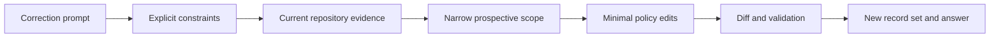

# Research: A Toy View of Handling a Narrow Correction

## Epistemic Boundary

This document is an educational model, not a dump of this agent's runtime. The actual tokenizer, model architecture, system context, parameters, attention values, hidden activations, logits, sampling settings, and private reasoning are not exposed by the available tools.

The factual, observable parts of this interaction are the supplied prompt, files read, Git diff, files changed, commands run, validation output, and final answer. Everything below labeled "toy" or "mock" is a learning analogy rather than captured model data.

## Observable Agent Pipeline

At the product level, the input-to-output path can be represented without claiming hidden reasoning:



The prompt supplied four controlling constraints:

| Prompt signal | Observable interpretation | Resulting action |
| --- | --- | --- |
| "just from this message onward" | Prospective rule only | Leave all earlier records unchanged |
| "make the researches records required" | Remove conditional policy wording | Update governance and workflow text |
| "DO NOT change any old record" | History preservation is a hard boundary | No backfill, allowlist, or old-record edit |
| "follow the same concept" | Match the established educational research form | Include model concepts, a toy example, tools, and limits |

This table is a human-readable summary of the transformation. It is not private chain-of-thought.

## Why Scope Words Matter

Natural-language requests often mix a desired outcome with boundaries. Here, "required" describes the outcome, while "from this message onward" and "do not change" constrain how it may be achieved.

A useful engineering abstraction is to treat the request as a constrained operation:

```text
maximize: future record completeness
subject to:
  old_records_changed = 0
  legacy_migration_logic = 0
  new_record_has_research = true
```

This is not an equation used internally by the model. It is a compact way for a reader to verify whether the delivered change satisfies the prompt.

## Transformer Concepts

A transformer commonly converts token IDs into vectors, adds positional information, and repeatedly mixes contextual information through attention and feed-forward layers before predicting a distribution for the next token.

For one attention head, learned projections produce query, key, and value matrices:

```text
Q = X Wq
K = X Wk
V = X Wv
scores = Q K^T / sqrt(dk)
attention = softmax(scores)
output = attention V
```

Context can make phrases such as "from this message onward" and "do not change any old record" relevant to the meaning of "required." Attention weights participate in contextual mixing, but they are not a complete or reliable explanation of why a model selected an action.

Inference uses already-trained parameters to generate output from the available context. It does not normally retrain the model on this prompt.

## Toy Python Attention Analogy

The following standard-library program uses invented vectors. It is not derived from this interaction or from the actual model. It only demonstrates how a query representing "what controls the edit scope?" could assign different weights to made-up requirement vectors.

```python
from math import exp, sqrt


labels = ["required", "from-now-on", "old-records", "same-concept"]
vectors = [
    [0.8, 0.2, 0.2],
    [0.5, 1.0, 0.3],
    [0.4, 0.9, 1.0],
    [0.6, 0.3, 0.8],
]
query = [0.5, 1.0, 0.9]


def dot(left, right):
    return sum(a * b for a, b in zip(left, right))


def softmax(values):
    maximum = max(values)
    numerators = [exp(value - maximum) for value in values]
    total = sum(numerators)
    return [value / total for value in numerators]


scores = [dot(query, vector) / sqrt(len(query)) for vector in vectors]
weights = softmax(scores)
for label, weight in zip(labels, weights):
    print(label, round(weight, 3))
```

Changing the query or vectors changes the output. A real transformer uses learned projections, many heads and layers, residual connections, normalization, nonlinear feed-forward networks, and much larger dimensions. The toy values cannot reveal actual attention or reasoning from this conversation.

## From Language Output to Coding-Agent Work

A coding agent adds an observable tool loop around language generation:

```text
read prompt -> inspect repository -> choose bounded edit -> receive tool result
-> compare result with constraints -> validate -> record -> answer
```

For this interaction:

- File reads established that research was described as optional in two governing documents.
- The ledger read established that earlier entries contain `research: null` and must remain untouched.
- The existing research file established the desired educational structure.
- Git diff established whether an earlier record had been modified.
- `zig build check` grounded repository-health claims.
- AJV grounded schema-validity claims without changing the schema.

The agent does not know that an edit or check succeeded merely because it generated a tool call. The returned tool result is the observable evidence.

## Mock Requirement Vectors

Another educational abstraction is to assign human-authored feature values to candidate approaches. These are not model embeddings:

| Candidate approach | Prospective | Preserves history | Simple | Matches research concept |
| --- | ---: | ---: | ---: | ---: |
| Backfill old records | 0.0 | 0.0 | 0.2 | 0.7 |
| Add legacy checker logic | 0.2 | 0.8 | 0.0 | 0.3 |
| Change policy and add one new pair | 1.0 | 1.0 | 1.0 | 1.0 |

The table makes the selected approach auditable: the third row is the only one satisfying all explicit constraints. It does not claim to reproduce an internal ranking calculation.

## What Changed From the Failed Attempts

The earlier attempts expanded "required" into a repository-wide migration. That introduced backfills, compatibility rules, and edits to earlier trace artifacts. The correction prompt made the missing priority explicit: temporal scope and record immutability outrank comprehensive retroactive enforcement.

The revised observable strategy was therefore:

1. Restore and inspect the current state.
2. Leave historical records, schema, and checker behavior alone.
3. Remove only conditional wording from future-facing policy.
4. Add one complete record set for the current prompt.
5. Verify the narrow diff and repository checks.

## What This Record Can and Cannot Teach

It can teach how explicit negative constraints reduce implementation scope, why repository reads and diffs matter, how tool feedback grounds claims, and how a toy attention calculation illustrates contextual weighting.

It cannot reveal exact tokenization, actual attention maps, hidden activations, logits, private reasoning, or a faithful causal explanation of the model's behavior. Those require diagnostic access not available in this interaction.

## Suggested Learning Experiments

- Run the toy program and increase the first dimension of `query` to observe how the weight for `required` changes.
- Replace softmax weighting with cosine similarity and compare the ranking.
- Convert the constraint table into assertions in a small policy validator without applying it retroactively.
- Compare a broad migration plan and a prospective-only plan by counting touched historical files.
- Use `git diff` before and after an edit to verify a claim such as "no old record changed."
