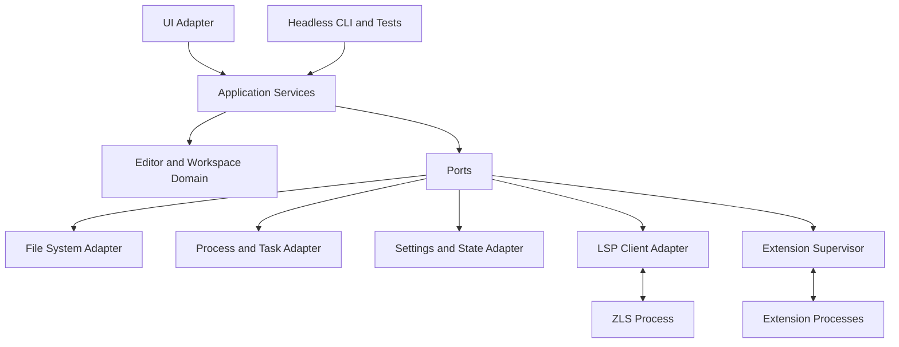
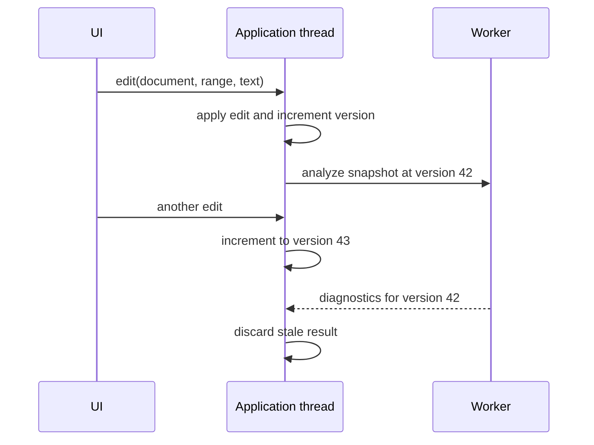
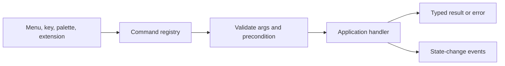

# System Architecture

## Shape

Zigide is a modular application with strict dependency direction and process boundaries for external tools. It begins as one main Zig executable plus child processes. Internal modules remain separable without creating a distributed system prematurely.

Dependencies point inward. Domain modules do not import a UI toolkit, operating-system API, ZLS detail, extension implementation, or persistence format.

## Source Boundaries

The implementation should begin with the following conceptual modules. Exact directory names may be adjusted by the first build-system ADR, but responsibilities must stay distinct.

| Boundary | Responsibility | Must not own |
| --- | --- | --- |
| `foundation` | IDs, clocks, cancellation, events, errors, logging interfaces, lifetimes | Product workflows |
| `text` | Buffers, positions, ranges, edits, selections, undo/redo, line index | Filesystem or UI |
| `workspace` | Documents, folders, dirty state, resource identity | Native dialogs or process launch |
| `commands` | Command registry, arguments, enablement, dispatch | Menu rendering |
| `application` | Use cases and service orchestration | Toolkit-specific widgets |
| `ports` | Interfaces for files, storage, processes, clipboard, watchers, UI scheduling | Platform implementation |
| `adapters` | macOS/platform services, JSON storage, LSP, extension RPC | Domain policy |
| `ui` | Views, input mapping, layout, rendering, accessibility bridge | Text-buffer algorithms |
| `app` | Composition root, startup, shutdown, dependency wiring | Reusable domain behavior |

## State and Concurrency

One application thread owns mutable editor and workspace state. This avoids pervasive locks and makes command ordering deterministic.

Background workers may perform file discovery, search, parsing, protocol I/O, and task output collection. A background result carries:

* operation ID;
* document or workspace version;
* cancellation state;
* typed success or error payload.

The application thread discards stale results. Workers never mutate documents directly.

Cancellation is cooperative. Ownership and allocator lifetime must be explicit at module boundaries. Long-lived services own their allocators; request-scoped work uses bounded arenas where practical.

## Text Model

The public text model is storage-independent. It exposes positions, ranges, batches of edits, snapshots, and version numbers.

The first implementation should use a piece table plus a line-start index because it supports cheap insert/delete operations and preserves the original file buffer. The design must benchmark large files and edit-heavy workloads before treating this choice as permanent. Storage can later move to a tree-backed piece table or rope without changing consumers.

Required invariants:

* Positions are zero-based internally and converted explicitly at protocol/UI boundaries.
* Each edit batch is validated before mutation.
* Undo and redo operate on transactions, not individual bytes.
* Line endings and final-newline state are preserved unless the user requests normalization.
* Text decoding policy is explicit; invalid UTF-8 never causes silent data loss.

## Services

Services are explicit structs passed through constructors or a small composition context. Zigide should not reproduce decorator-based dependency injection. A service interface is useful only when there is a real adapter, test double, or process boundary.

Core services:

* workspace and document;
* file and file-watch;
* command and keybinding;
* configuration;
* search;
* task and process;
* language client;
* diagnostics;
* storage and recovery;
* extension supervisor;
* logging and notification.

Events are typed and scoped. Subscriptions return a disposable handle. Event handlers must not rely on unspecified ordering unless the contract states it.

## Command Flow

Commands are the shared action boundary for menus, keybindings, the palette, tests, and extensions.

Command IDs are namespaced, stable strings. Public command argument and result schemas are versioned once exposed to extensions.

## External Protocols

* Use LSP for language intelligence, with ZLS as the first server.
* Reserve DAP for a later debugger adapter.
* Use JSON-RPC 2.0 semantics with explicit protocol versions for extension communication.
* Centralize framing, cancellation, error mapping, size limits, and logging instead of reimplementing them per protocol.

## Failure Model

Expected failures are typed and surfaced with context. The application should continue when a language server or extension crashes. Repeated child-process crashes use bounded restart with visible status; they never enter an infinite restart loop.

Shutdown order is explicit: stop accepting commands, persist recovery state, cancel workers, request child-process shutdown, enforce a deadline, flush logs, then release resources.
