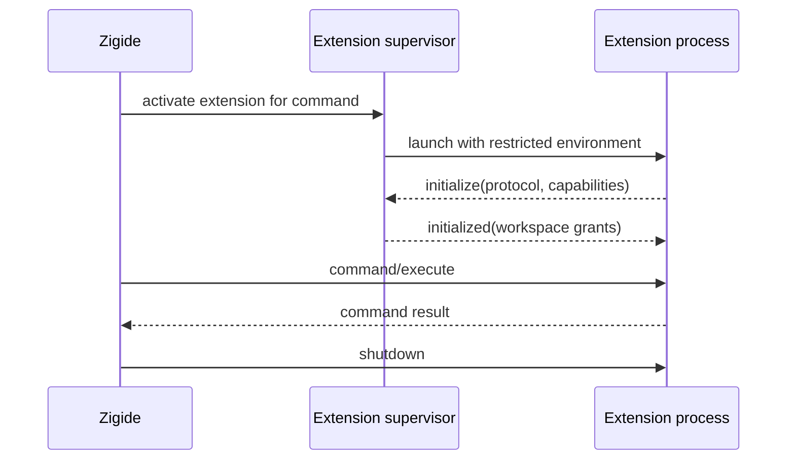

# Extension Model

## Goals

The extension system broadens Zigide without making internal modules public API. It must be understandable, versioned, lazily activated, locally testable, and resilient to extension crashes.

VS Code extensions are not compatible. Zigide uses its own smaller protocol.

## Package

An unpacked extension directory contains a declarative `zigide-extension.json` manifest and an executable entry point when code is required.

Illustrative manifest:

```json
{
  "manifestVersion": 1,
  "id": "example.word-count",
  "version": "0.1.0",
  "displayName": "Word Count",
  "protocol": "1.0",
  "entrypoint": "bin/word-count",
  "activationEvents": ["onCommand:example.wordCount"],
  "contributes": {
    "commands": [
      {
        "id": "example.wordCount",
        "title": "Count Words"
      }
    ]
  },
  "permissions": ["documents:read"]
}
```

This is a design example, not a frozen schema. The implementation ADR must define JSON Schema, path rules, platform executable selection, validation errors, and the protocol version representation (the `"1.0"` string above versus explicit major/minor fields) so the manifest and the initialization handshake use one consistent form before packages are accepted.

## Runtime Boundary

Extension code runs outside the main IDE process. The supervisor launches an extension executable and communicates over framed standard input/output. Standard error is reserved for extension logs.



The initial threat model treats installed extensions as trusted local programs. A process boundary provides crash containment and API discipline, not a security sandbox. Permission declarations inform users and allow future enforcement, but must not be described as protection until operating-system controls enforce them.

## Protocol

The wire protocol follows JSON-RPC 2.0 request, response, notification, cancellation, and error concepts. Messages use `Content-Length` framing so payloads can contain newlines and the framing code can be shared with LSP.

Every session begins with initialization that negotiates:

* protocol major and minor version;
* IDE and extension identity;
* declared and granted capabilities;
* workspace roots exposed to the extension;
* message-size and timeout limits.

Major versions may break compatibility. Minor versions add optional capabilities. Unknown fields are ignored only where the schema explicitly allows it.

## Initial Contribution Points

Version 1 should remain deliberately small:

* commands;
* keybinding defaults;
* language metadata;
* task providers;
* read-only document access;
* diagnostics;
* notifications and output channels.

Menus, themes, custom views, webviews, debuggers, and arbitrary UI injection are deferred until a real use case and stable UI model exist.

## Activation and Lifecycle

Supported activation events begin with `onCommand`, `onLanguage`, and explicit startup for a small set of essential extensions. Contributions are indexed from manifests without starting extension processes.

The supervisor owns state transitions:

`discovered -> validated -> inactive -> starting -> active -> stopping -> stopped/failed`

Startup and requests have deadlines. Crashes are reported and isolated. Automatic restart is bounded and disabled for deterministic startup failures.

## SDK and Compatibility

The official SDK is written in Zig and provides framing, JSON-RPC types, initialization, cancellation, and test helpers. Because the transport is language-neutral, other languages can implement the protocol without linking Zigide internals.

Compatibility tests run an extension fixture against each supported protocol version. The manifest schema and protocol fixtures are public artifacts and are reviewed like source APIs.
